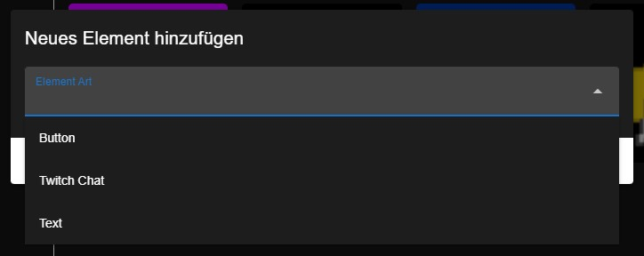
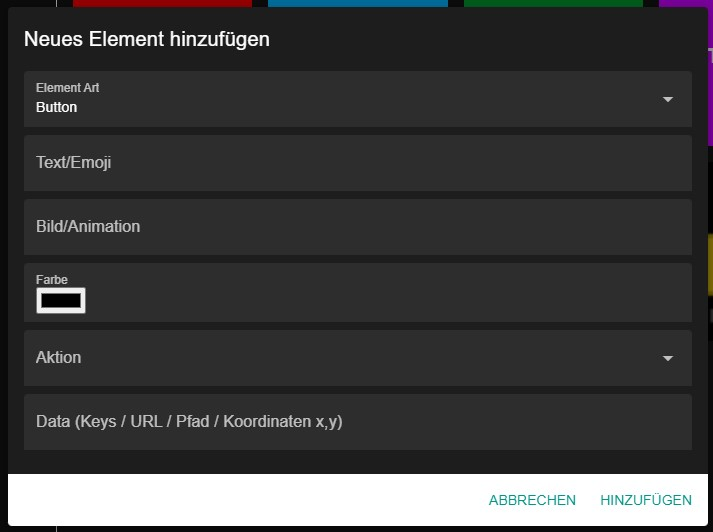
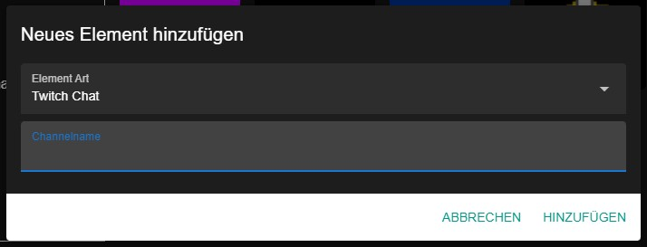

# Configure TomatoDeck

Download the setup file from the releases section in GitHub and install it. After the application had loaded you can set a new password with a click on the bottom right lock symbole. Now you can set add a new button by clicking on the floating action button on the bottom right.

You can choose between:

- **Button**: triggers an action when clicked
- **Twitch Chat**: shows one twitch chat
- **Text**: looks like a button but triggers no action
- **Layout**: creates a new layout

## Add a button

If you choose to configure a button you will get presented with the following dialog:

Available settings:

- **Text/Emoji**: Set a text or emoji which will be displayed in the button (Windows: `Windows + .` macOS: `Control + Command + Space`)
- **Image/Animation**: You can choose an image or GIF which will get displayed inside the button. (The text wont be visible if you choose to set an image)
- **Color**: The background color of the button
- **Action**: This is the type of action which will get executed when the button is clicked
  - **keys**: Types the keys specified in the _Data_ setting ([All available keys](https://nut-tree.github.io/apidoc/enums/key_enum.Key.html))
  - **hotkey**: Holds the all keys but the last one and clicks the last one to execute a hotkey ([All available keys](https://nut-tree.github.io/apidoc/enums/key_enum.Key.html))
  - **open_website**: Opens url specified in the _Data_ setting in your default browser
  - **run_exe**: Runs the EXE file specified in the _Data_ setting (Format: Path)
  - **open_folder**: Opens a folder specified in the _Data_ setting (Format: Path)
  - **click_mouse**: Clicks the mouse on a specific point on your screen (Format for _Data_ setting: `x,y`)
  - **play_sound**: Plays an audio file specified in the _Data_ setting (Format: Path)
  - **counter**: Converts your button into a counter (Format: Number you want the counter to start with)
  - **http_get_request**: Performs a HTTP GET Request to the specified URL (Format: URL)
  - **switch_layout**: Lets you switch between all your layouts (Format: next, last, layout name)
  - **discord**: Lets you interact with your Discord client directly without hotkeys.
  - **twitch_chat_message**: Lets you send a message to one or more twitch chats. You can set multiple channels by seperating them with commas. _You have to specify the account from which TomatoDeck should send those messages._

## Add twitch chat

If you choose to configure Twitch Chat you will get presented with the following dialog where you have to specify a channelname from Twitch:

## Add text

If you choose to configure Text you will get presented with the following dialog where you have to specify the text and color of the button:

